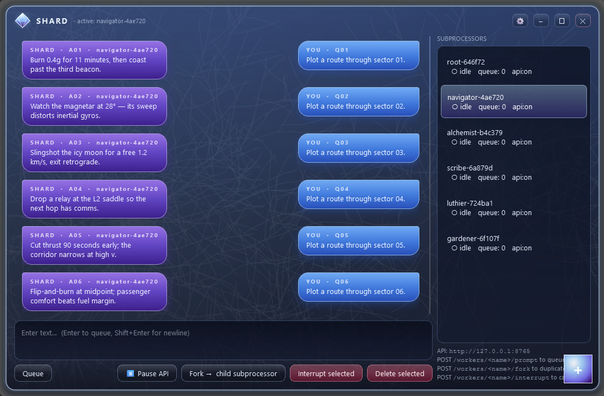

# Shard

A borderless, glassy desktop console that **tracks text in queued, forkable
"subprocessor" workers** and exposes them over a small **local HTTP API**.



There is **no model**. Each worker simply records text you (or an API caller)
queue into it. Workers can be forked into autonomous children that share the
parent's transcript at fork time, and any of them can be interrupted at any
time without affecting the others.

## Run

```powershell
python -m venv .venv
.\.venv\Scripts\Activate.ps1
pip install -r requirements.txt
python -m shard
```

The HTTP API binds to `127.0.0.1:8765` by default (loopback only).

## API

Set `SHARD_API_TOKEN` to require `Authorization: Bearer <token>` on every call.

| Method | Path                                | Body                  | Notes                  |
|--------|-------------------------------------|-----------------------|------------------------|
| GET    | `/healthz`                          |                       |                        |
| GET    | `/workers`                          |                       | list workers           |
| POST   | `/workers`                          | `{"prefix":"agent"}`  | create root worker     |
| GET    | `/workers/<name>`                   |                       | status                 |
| GET    | `/workers/<name>/history`           |                       | full transcript        |
| POST   | `/workers/<name>/prompt`            | `{"text":"hello"}`    | enqueue text           |
| POST   | `/workers/<name>/fork`              |                       | duplicate worker       |
| POST   | `/workers/<name>/interrupt`         |                       | cancel + clear queue   |

Example:

```powershell
$base = "http://127.0.0.1:8765"
$ws = (Invoke-RestMethod "$base/workers").workers
$root = $ws[0].name
Invoke-RestMethod -Method Post -Uri "$base/workers/$root/prompt" `
    -ContentType "application/json" -Body '{"text":"first item"}'
$child = (Invoke-RestMethod -Method Post -Uri "$base/workers/$root/fork").name
Invoke-RestMethod -Method Post -Uri "$base/workers/$child/prompt" `
    -ContentType "application/json" -Body '{"text":"runs in the child"}'
Invoke-RestMethod -Method Post -Uri "$base/workers/$child/interrupt"
```

## UI

- Frameless, resizable glassy window with a custom Shard logo.
- Rich-text transcript pane on the left; multi-line input below it
  (`Enter` queues, `Shift+Enter` for newline).
- Subprocessors panel on the right; select to view, **Fork** to duplicate the
  active worker, **Interrupt** to cancel the in-flight item and clear the
  selected worker's queue.
